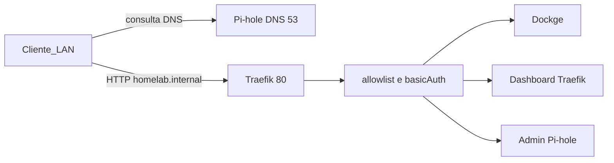

# Homelab Setup

Homelab em Docker Compose para Debian/Ubuntu. Traefik, Pi-hole e Dockge compartilham a rede `proxy`, criada pelo [`compose.yaml`](compose.yaml) da raiz. Cada pasta em `stacks/` é um projeto Compose independente. O Pi-hole resolve `*.homelab.internal` para o IP LAN do host (`HOMELAB_IP`).

A partir da v4 o HTTP dos painéis exige **basicAuth + allowlist da LAN**. DNS e porta 80 no host escutam só em `127.0.0.1` e em `HOMELAB_IP`.

## Arquitetura



O bootstrap em [`setup-homelab.sh`](setup-homelab.sh) instala dependências, configura UFW e Docker, pede o `.env` (senhas sem eco), aplica as migrações e sobe as stacks.

## Pré-requisitos

- Debian ou Ubuntu
- Acesso sudo
- IP LAN do host (detectado na instalação; fallback em [`.env.example`](.env.example): `192.168.15.42`)

## Início rápido

```bash
./setup-homelab.sh
```

O script é idempotente. Ele:

1. Atualiza o apt e instala dependências (`curl`, `python3`, `openssl`, `bind9-dnsutils`, `ufw`, …)
2. Configura o UFW (22/80/443) e ativa o firewall se ainda estiver inativo (a v4 restringe depois ao CIDR da LAN)
3. Instala Docker Engine e Compose pelo repositório oficial (Debian ou Ubuntu conforme `/etc/os-release`), se ainda não existirem
4. Adiciona o usuário atual ao grupo `docker`
5. Cria `.env` se faltar e pergunta `HOMELAB_IP`, `HOMELAB_LAN_CIDR`, senha do Pi-hole e basicAuth do Traefik (Enter mantém o valor atual; senhas recusam vazio/`admin`); preenche `DOCKGE_STACKS_DIR` e gera `stacks/traefik/.htpasswd`
6. Aplica migrações até a versão em [`VERSION`](VERSION)
7. Roda [`scripts/stacks-up.sh`](scripts/stacks-up.sh) (Pi-hole → DNS check → Traefik → demais)

Sem TTY (pipe/CI) o prompt não grava senha default: o `.env` já precisa de senhas fortes. Se o usuário acabou de entrar no grupo `docker`, o setup tenta `sg docker` para subir os containers na mesma sessão. Se isso falhar, faça logoff/login (ou `newgrp docker`) e rode `./scripts/stacks-up.sh`.

O helper garante a rede `proxy`, sobe Pi-hole primeiro, roda [`scripts/check-dns.sh`](scripts/check-dns.sh) e só então Traefik e as demais stacks. `docker compose up -d` na raiz **não** sobe serviços (só a rede). Para só recriar as stacks depois do setup:

```bash
./scripts/stacks-up.sh
```

Para só validar o DNS:

```bash
./scripts/check-dns.sh
```

Host já na v3: rode `./setup-homelab.sh` de novo. Ele aplica a v4 (UFW por CIDR, `DOCKER-USER`, htpasswd) e recria as stacks. Vai pedir senhas se a do Pi-hole ainda for `admin`.

## Serviços e acesso

O Traefik escuta na porta 80 (`127.0.0.1` e `HOMELAB_IP`) e encaminha pelo `Host`. Painéis pedem o usuário/senha do basicAuth e só aceitam a LAN (`HOMELAB_LAN_CIDR`) e loopback. **Não há fallback** `:8080`, `:8053` ou `:5001`.

| Serviço  | URL (porta 80, LAN)                     | Observação |
|----------|-----------------------------------------|------------|
| Traefik  | `http://traefik.homelab.internal/`      | Redirect nativo para `/dashboard/`; `api.insecure` desligado |
| Pi-hole  | `http://pihole.homelab.internal/admin/` | `/` redireciona para `/admin/`; senha `PIHOLE_PASSWORD` (depois do basicAuth) |
| Dockge   | `http://dockge.homelab.internal/`       | Dados em `stacks/dockge/data/`; socket Docker RW (ver notas) |

O Pi-hole publica um wildcard DNS (`address=/homelab.internal/${HOMELAB_IP}`) em [`stacks/pihole/compose.yaml`](stacks/pihole/compose.yaml). Qualquer nome em `*.homelab.internal` resolve para o IP do host.

Para usar esses nomes, aponte o DNS do cliente (ou do roteador) para o IP LAN do host, porta 53. Não faça port forward de 53 nem 80 no roteador para a WAN.

## Variáveis de ambiente

Definidas em [`.env.example`](.env.example) e lidas pelo Compose:

| Variável                       | Função |
|--------------------------------|--------|
| `HOMELAB_IP`                   | IP LAN usado no wildcard DNS e no bind das portas |
| `HOMELAB_LAN_CIDR`             | CIDR da LAN (`/24` derivado do IP se vazio); UFW, `DOCKER-USER` e allowlist |
| `PIHOLE_PASSWORD`              | Senha do admin do Pi-hole (obrigatória; não use `admin`) |
| `HOMELAB_BASICAUTH_USER`       | Usuário HTTP do Traefik |
| `HOMELAB_BASICAUTH_PASSWORD`   | Senha HTTP do Traefik (grava `stacks/traefik/.htpasswd`) |
| `DOCKGE_STACKS_DIR`            | Path absoluto de `stacks/` (host === container) |

`.env` e `.htpasswd` estão no [`.gitignore`](.gitignore) (`chmod 600`). O setup pergunta IP, CIDR e senhas a cada execução interativa; `DOCKGE_STACKS_DIR` só é preenchido se a chave estiver vazia ou ausente.

## Migrações de infra

A versão alvo fica em [`VERSION`](VERSION) (hoje `4`). O estado por host fica em `.homelab/state.json` (gitignored).

| Script | O que faz |
|--------|-----------|
| [`scripts/migrate/v1.sh`](scripts/migrate/v1.sh) | Baseline (Docker, UFW 22/80/443, grupo `docker`). Já feito pelo bootstrap; o script só fecha o ledger. |
| [`scripts/migrate/v2.sh`](scripts/migrate/v2.sh) | Libera 53 TCP/UDP e 8053 no UFW; desliga o `DNSStubListener` do systemd-resolved para o Pi-hole usar a porta 53. |
| [`scripts/migrate/v3.sh`](scripts/migrate/v3.sh) | Garante a rede `proxy`, aponta `/etc/resolv.conf` para `127.0.0.1`, remove o Portainer e o volume `portainer_data`. O recreate das stacks é o [`scripts/stacks-up.sh`](scripts/stacks-up.sh). |
| [`scripts/migrate/v4.sh`](scripts/migrate/v4.sh) | UFW só a partir de `HOMELAB_LAN_CIDR` (remove 8053 e regras any); filtro persistente `DOCKER-USER`; gera `.htpasswd`. O recreate das stacks é o [`scripts/stacks-up.sh`](scripts/stacks-up.sh). |

- Instalação nova: `applied_version` começa em `0` e aplica v1 → v2 → v3 → v4.
- Host legado com a rede Docker `proxy` já existente: o bootstrap inicia em `1` e aplica v2 → v3 → v4.

Para uma v5: crie `scripts/migrate/v5.sh` e incremente `VERSION` para `5`. Na próxima execução de `./setup-homelab.sh` a migração roda automaticamente.

## Estrutura do repositório

```
.
├── setup-homelab.sh          # Bootstrap do host + .env + migrações + stacks
├── compose.yaml              # Rede proxy (sem include)
├── VERSION                   # Versão alvo da infra
├── .env.example
├── stacks/                   # Um projeto Compose por pasta
│   ├── traefik/
│   ├── pihole/
│   └── dockge/
└── scripts/
    ├── stacks-up.sh          # Sobe as stacks (Pi-hole primeiro)
    ├── check-dns.sh          # UDP/TCP, wildcard, LAN, forwarding
    ├── lib/                  # .env e .homelab/state.json
    └── migrate/              # v1.sh, v2.sh, v3.sh, v4.sh, …
```

## Firewall

UFW com default deny incoming / allow outgoing. A v4 substitui as regras “any” por origem `HOMELAB_LAN_CIDR`. O Docker ainda publica via iptables: o unit `homelab-docker-filter` preenche a cadeia `DOCKER-USER` (LAN + loopback + established; drop o resto; IPv6 só `::1`).

| Origem              | Portas                         |
|---------------------|--------------------------------|
| Bootstrap           | 22/tcp, 80/tcp, 443/tcp (any; a v4 restringe) |
| Migração v2         | 53/tcp, 53/udp, 8053/tcp (any; a v4 restringe/remove 8053) |
| Migração v4         | 22, 80, 443, 53 tcp/udp from `HOMELAB_LAN_CIDR` |

## Notas de segurança

- Painéis atrás de allowlist (`HOMELAB_LAN_CIDR` + `127.0.0.1`) e basicAuth no Traefik. HTTP na LAN: o basicAuth é visível para quem sniffar o cabo/Wi-Fi.
- Dashboard do Traefik: `api.insecure: false`; sem porta 8080 no host.
- Pi-hole: `listeningMode: LOCAL`, DNS só em loopback + `HOMELAB_IP`, sem `:8053`. Imagem pinada em `2026.07.2`.
- Dockge não publica `:5001`. O socket Docker continua RW (RCE no Dockge = root no host); o proxy só reduz a exposição.
- Grupo `docker` ≡ root. SSH na v4 fica restrito ao CIDR da LAN; chave SSH e fail2ban são operação no host, não automatizadas.
- DNS do host aponta para `127.0.0.1` (Pi-hole). Não encaminhe 53/80 na WAN; IPv6 publicado pelo Docker é dropado no `DOCKER-USER` salvo loopback.
- Não commite `.env` nem `stacks/traefik/.htpasswd`.
