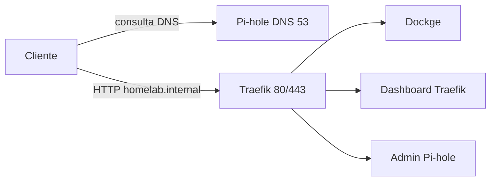

# Homelab Setup

Homelab em Docker Compose para Debian/Ubuntu. Traefik, Pi-hole e Dockge compartilham a rede `proxy`, criada pelo [`compose.yaml`](compose.yaml) da raiz. Cada pasta em `stacks/` é um projeto Compose independente. O Pi-hole resolve `*.homelab.internal` para o IP LAN do host (`HOMELAB_IP`).

## Arquitetura



O bootstrap em [`setup-homelab.sh`](setup-homelab.sh) instala dependências, configura UFW e Docker, pede o `.env` (Enter = padrão), aplica as migrações e sobe as stacks.

## Pré-requisitos

- Debian ou Ubuntu
- Acesso sudo
- IP LAN do host (detectado na instalação; fallback em [`.env.example`](.env.example): `192.168.15.42`)

## Início rápido

```bash
./setup-homelab.sh
```

O script é idempotente. Ele:

1. Atualiza o apt e instala dependências (`curl`, `python3`, `bind9-dnsutils`, `ufw`, …)
2. Configura o UFW (22/80/443) e ativa o firewall se ainda estiver inativo
3. Instala Docker Engine e Compose pelo repositório oficial, se ainda não existirem
4. Adiciona o usuário atual ao grupo `docker`
5. Cria `.env` se faltar e pergunta `HOMELAB_IP` e `PIHOLE_PASSWORD` (Enter mantém o padrão); preenche `DOCKGE_STACKS_DIR` com o path absoluto de `stacks/`
6. Aplica migrações até a versão em [`VERSION`](VERSION)
7. Roda [`scripts/stacks-up.sh`](scripts/stacks-up.sh) (Pi-hole → DNS check → Traefik → demais)

Sem TTY (pipe/CI) o prompt é pulado e os padrões são gravados. Se o usuário acabou de entrar no grupo `docker`, o setup tenta `sg docker` para subir os containers na mesma sessão. Se isso falhar, faça logoff/login (ou `newgrp docker`) e rode `./scripts/stacks-up.sh`.

O helper garante a rede `proxy`, sobe Pi-hole primeiro, roda [`scripts/check-dns.sh`](scripts/check-dns.sh) e só então Traefik e as demais stacks. `docker compose up -d` na raiz **não** sobe serviços (só a rede). Para só recriar as stacks depois do setup:

```bash
./scripts/stacks-up.sh
```

Para só validar o DNS:

```bash
./scripts/check-dns.sh
```

## Serviços e acesso

O Traefik escuta na porta 80 e encaminha pelo `Host`. As portas publicadas no host continuam como fallback.

| Serviço  | Padrão (porta 80)                       | Fallback | Observação                                      |
|----------|-----------------------------------------|----------|-------------------------------------------------|
| Traefik  | `http://traefik.homelab.internal/`      | `:8080`  | Redirect nativo para `/dashboard/`; `api.insecure` |
| Pi-hole  | `http://pihole.homelab.internal/admin/` | `:8053`  | `/` redireciona para `/admin/`; senha `PIHOLE_PASSWORD` |
| Dockge   | `http://dockge.homelab.internal/`       | `:5001`  | Dados em `stacks/dockge/data/`                  |

O Pi-hole publica um wildcard DNS (`address=/homelab.internal/${HOMELAB_IP}`) em [`stacks/pihole/compose.yaml`](stacks/pihole/compose.yaml). Qualquer nome em `*.homelab.internal` resolve para o IP do host.

Para usar esses nomes, aponte o DNS do cliente (ou do roteador) para o IP LAN do host, porta 53.

Acesso direto por IP também funciona: `http://<HOMELAB_IP>:8080` (Traefik), `:8053` (Pi-hole), `:5001` (Dockge).

## Variáveis de ambiente

Definidas em [`.env.example`](.env.example) e lidas pelo Compose:

| Variável            | Função                                              |
|---------------------|-----------------------------------------------------|
| `HOMELAB_IP`        | IP LAN usado no wildcard DNS                        |
| `PIHOLE_PASSWORD`   | Senha do admin do Pi-hole                           |
| `DOCKGE_STACKS_DIR` | Path absoluto de `stacks/` (host === container)     |

`.env` está no [`.gitignore`](.gitignore). O setup pergunta `HOMELAB_IP` e `PIHOLE_PASSWORD` a cada execução interativa (Enter mantém o valor atual ou o padrão); `DOCKGE_STACKS_DIR` só é preenchido se a chave estiver vazia ou ausente.

## Migrações de infra

A versão alvo fica em [`VERSION`](VERSION) (hoje `3`). O estado por host fica em `.homelab/state.json` (gitignored).

| Script | O que faz |
|--------|-----------|
| [`scripts/migrate/v1.sh`](scripts/migrate/v1.sh) | Baseline (Docker, UFW 22/80/443, grupo `docker`). Já feito pelo bootstrap; o script só fecha o ledger. |
| [`scripts/migrate/v2.sh`](scripts/migrate/v2.sh) | Libera 53 TCP/UDP e 8053 no UFW; desliga o `DNSStubListener` do systemd-resolved para o Pi-hole usar a porta 53. |
| [`scripts/migrate/v3.sh`](scripts/migrate/v3.sh) | Garante a rede `proxy`, aponta `/etc/resolv.conf` para `127.0.0.1`, remove o Portainer e o volume `portainer_data`. O recreate das stacks é o [`scripts/stacks-up.sh`](scripts/stacks-up.sh). |

- Instalação nova: `applied_version` começa em `0` e aplica v1 → v2 → v3.
- Host legado com a rede Docker `proxy` já existente: o bootstrap inicia em `1` e aplica v2 → v3.

Para uma v4: crie `scripts/migrate/v4.sh` e incremente `VERSION` para `4`. Na próxima execução de `./setup-homelab.sh` a migração roda automaticamente.

## Estrutura do repositório

```
.
├── setup-homelab.sh          # Bootstrap do host + .env + migrações + stacks
├── compose.yaml              # Rede proxy (sem include)
├── VERSION                   # Versão alvo da infra
├── .env.example
├── stacks/                   # Um projeto Compose por pasta
│   ├── traefik/
│   ├── pihole/
│   └── dockge/
└── scripts/
    ├── stacks-up.sh          # Sobe as stacks (Pi-hole primeiro)
    ├── check-dns.sh          # UDP/TCP, wildcard, LAN, forwarding
    ├── lib/                  # .env e .homelab/state.json
    └── migrate/              # v1.sh, v2.sh, v3.sh, …
```

## Firewall

UFW com default deny incoming / allow outgoing.

| Origem              | Portas                         |
|---------------------|--------------------------------|
| Bootstrap           | 22/tcp, 80/tcp, 443/tcp        |
| Migração v2         | 53/tcp, 53/udp, 8053/tcp       |

## Notas de segurança

- O dashboard do Traefik está em modo `insecure` na porta 80 (`traefik.homelab.internal`) e na 8080. Use só na LAN.
- Traefik monta o Docker socket em leitura (`:ro`); Dockge precisa de escrita.
- Não commite `.env`. Troque a senha default do Pi-hole antes de expor o host na rede.
