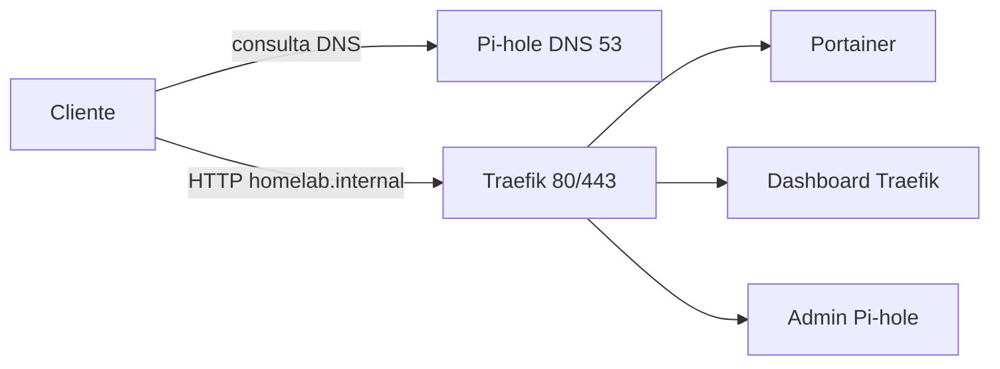

# Homelab Setup

Homelab em Docker Compose para Debian/Ubuntu. Traefik, Pi-hole e Portainer compartilham a rede `proxy`. O Pi-hole resolve `*.homelab.internal` para o IP LAN do host (`HOMELAB_IP`).

## Arquitetura



O bootstrap em [`setup-homelab.sh`](setup-homelab.sh) instala dependências, configura UFW e Docker, cria `.env` se faltar e aplica as migrações de infra.

## Pré-requisitos

- Debian ou Ubuntu
- Acesso sudo
- IP LAN do host (padrão em [`.env.example`](.env.example): `192.168.15.42`)

## Início rápido

```bash
./setup-homelab.sh
```

O script é idempotente. Ele:

1. Atualiza o apt e instala dependências (`curl`, `python3`, `ufw`, …)
2. Configura o UFW (22/80/443) e ativa o firewall se ainda estiver inativo
3. Instala Docker Engine e Compose pelo repositório oficial, se ainda não existirem
4. Adiciona o usuário atual ao grupo `docker`
5. Copia `.env.example` → `.env` somente se `.env` ainda não existir
6. Aplica migrações até a versão em [`VERSION`](VERSION)

Em seguida, ajuste o `.env`:

```bash
# IP LAN deste host e senha do admin do Pi-hole
HOMELAB_IP=192.168.15.42
PIHOLE_PASSWORD=admin
```

Se o script acabou de adicionar seu usuário ao grupo `docker`, faça logoff e login (ou `newgrp docker`) antes de subir os containers:

```bash
docker compose up -d
```

## Serviços e acesso

| Serviço   | Host Traefik                    | Portas no host     | Observação                                      |
|-----------|---------------------------------|--------------------|-------------------------------------------------|
| Traefik   | `traefik.homelab.internal`      | 80, 443, 8080      | Dashboard também em `:8080` (`api.insecure`)    |
| Pi-hole   | `pihole.homelab.internal`       | 53 TCP/UDP, 8053   | Admin em `:8053`; senha `PIHOLE_PASSWORD`       |
| Portainer | `portainer.homelab.internal`    | 9000, 9443         | Volume `portainer_data`                         |

O Pi-hole publica um wildcard DNS (`address=/homelab.internal/${HOMELAB_IP}`) em [`stacks/pihole/compose.yaml`](stacks/pihole/compose.yaml). Qualquer nome em `*.homelab.internal` resolve para o IP do host.

Para usar esses nomes, aponte o DNS do cliente (ou do roteador) para o IP LAN do host, porta 53.

Acesso direto por IP também funciona: `http://<HOMELAB_IP>:8080` (Traefik), `:8053` (Pi-hole), `:9000` (Portainer).

## Variáveis de ambiente

Definidas em [`.env.example`](.env.example) e lidas pelo Compose:

| Variável           | Função                                      |
|--------------------|---------------------------------------------|
| `HOMELAB_IP`       | IP LAN usado no wildcard DNS                |
| `PIHOLE_PASSWORD`  | Senha do admin do Pi-hole                   |

`.env` está no [`.gitignore`](.gitignore). O setup não sobrescreve um `.env` já existente.

## Migrações de infra

A versão alvo fica em [`VERSION`](VERSION) (hoje `2`). O estado por host fica em `.homelab/state.json` (gitignored).

| Script | O que faz |
|--------|-----------|
| [`scripts/migrate/v1.sh`](scripts/migrate/v1.sh) | Baseline (Docker, UFW 22/80/443, grupo `docker`). Já feito pelo bootstrap; o script só fecha o ledger. |
| [`scripts/migrate/v2.sh`](scripts/migrate/v2.sh) | Libera 53 TCP/UDP e 8053 no UFW; desliga o `DNSStubListener` do systemd-resolved para o Pi-hole usar a porta 53. |

- Instalação nova: `applied_version` começa em `0` e aplica v1 → v2.
- Host legado com a rede Docker `proxy` já existente: o bootstrap inicia em `1` e só aplica v2.

Para uma v3: crie `scripts/migrate/v3.sh` e incremente `VERSION` para `3`. Na próxima execução de `./setup-homelab.sh` a migração roda automaticamente.

## Estrutura do repositório

```
.
├── setup-homelab.sh          # Bootstrap do host + migrações
├── compose.yaml              # Include das stacks + rede proxy
├── VERSION                   # Versão alvo da infra
├── .env.example
├── stacks/
│   ├── traefik/
│   ├── pihole/
│   └── portainer/
└── scripts/
    ├── lib/                  # Banco local .homelab/state.json
    └── migrate/              # v1.sh, v2.sh, …
```

## Firewall

UFW com default deny incoming / allow outgoing.

| Origem              | Portas                         |
|---------------------|--------------------------------|
| Bootstrap           | 22/tcp, 80/tcp, 443/tcp        |
| Migração v2         | 53/tcp, 53/udp, 8053/tcp       |

## Notas de segurança

- O dashboard do Traefik está em modo `insecure` na porta 8080. Use só na LAN.
- Traefik monta o Docker socket em leitura (`:ro`); Portainer precisa de escrita.
- Não commite `.env`. Troque a senha default do Pi-hole antes de expor o host na rede.
